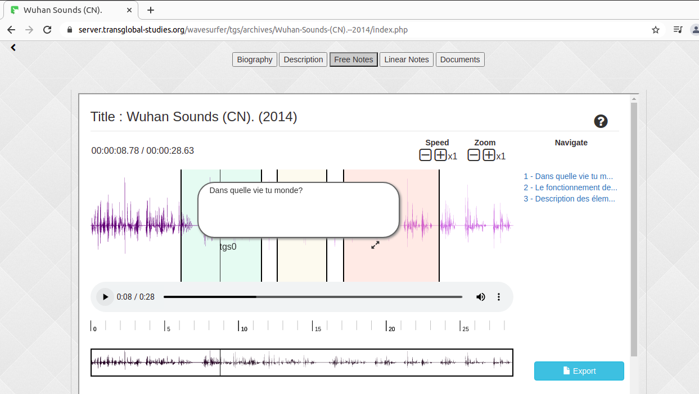

A.N.a.B. is a collaborative audio annotation tool
that can be used for different purposes :
transcription, translation, comments on music, story telling, ...

Notes can include images and links to make reference
to some other ressources and enrich your audio archives.

You can aggregate your notes in an audio book
and generate it for use on all your devices.

It is based on the wavesurfer.js library
that uses the Web Audio Api
to process audio within the browser.

This project was created for the [Transglobal Studies](https://blog.transglobal-studies.org/) workgroup
which aims at fostering reflection and dialog
on trans-frontiers globalization issues. 

author/ideas : chevil@giss.tv

contributor/ideas : beatrice.rettig@free.fr

